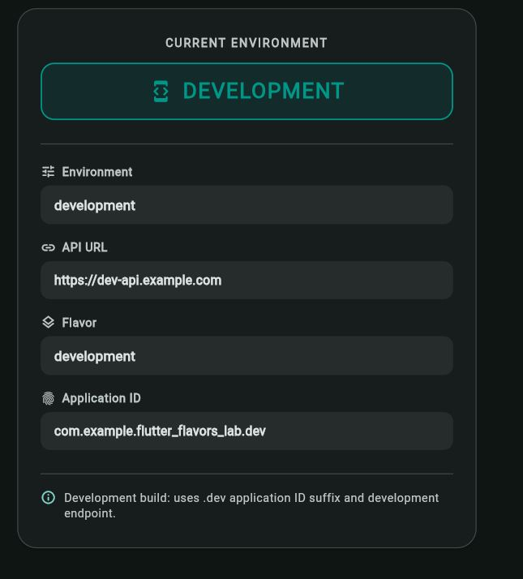
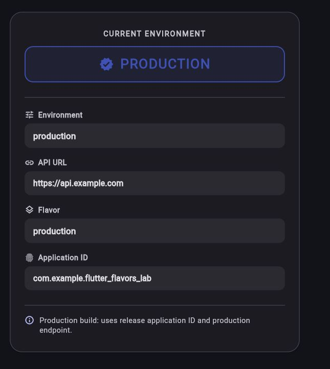

# Flutter Flavors Lab

A practical Flutter lab demonstrating how to configure and run multiple environments from a single codebase using **Flutter Flavors**, `--dart-define`, and separate entry points.

---

## What is Flutter Flavors?

Flutter Flavors allow developers to create multiple variants of the same application (such as Development, Staging, or Production) from a single shared codebase. Each flavor can have its own:

* **Application ID / Package Name** (allowing side-by-side installations on the same device)
* **Application Name** (e.g., *Flavors Lab Development* vs *Flavors Lab Production*)
* **Environment Configurations & Base URLs** (e.g., dev API vs production API)
* **Build Settings & Icons**

---

## Environments

| Environment | Status | Description |
| :--- | :--- | :--- |
| **Development** | **Implemented** | Local development, rapid iteration, `.dev` ID suffix |
| **Production** | **Implemented** | Production-ready configuration, base Application ID |
| *Staging* | *Concept / Extension* | Architectural concept for pre-release QA (not configured as an Android flavor in this lab) |

---

## What is Implemented?

* **Android Product Flavors** configured in `build.gradle.kts` (`development` and `production`).
* **Distinct Application IDs** using `applicationIdSuffix = ".dev"` for development.
* **Distinct App Names** dynamically populated via Android `resValue("string", "app_name", ...)`.
* **Compile-time Variables** passed with `--dart-define=ENV=...` and accessed via `String.fromEnvironment('ENV')`.
* **Centralized Configuration Model** using `AppConfig` (holds `environment` and `apiUrl`).
* **Dedicated Entry Points** (`main_development.dart` and `main_production.dart`).
* **Visual Dashboard Demo UI** built with Material 3 that dynamically reflects the active environment, API URL, and flavor.
* **Pre-configured VS Code Launch Profiles** in `.vscode/launch.json`.
* **Verified APK Builds** for both flavors.

---

## Project Structure

```text
lib/
├── config/
│   └── app_config.dart          # Configuration model (environment, apiUrl)
├── main.dart                    # Shared app UI & dashboard screen
├── main_development.dart       # Development entry point
└── main_production.dart        # Production entry point

android/
└── app/
    ├── build.gradle.kts         # Product flavors & applicationIdSuffix definition
    └── src/
        └── main/
            └── AndroidManifest.xml # Uses @string/app_name

.vscode/
└── launch.json                  # VS Code Run & Debug configurations
```

---

## Flavor Comparison

| Feature | Development | Production |
| :--- | :--- | :--- |
| **Flavor Name** | `development` | `production` |
| **Entry Point** | `lib/main_development.dart` | `lib/main_production.dart` |
| **App Name** | `Flavors Lab Development` | `Flavors Lab Production` |
| **Application ID** | `com.example.flutter_flavors_lab.dev` | `com.example.flutter_flavors_lab` |
| **`--dart-define`** | `ENV=development` | `ENV=production` |
| **API URL** | `https://dev-api.example.com` | `https://api.example.com` |

Because each flavor has a distinct Application ID, both applications can be installed and tested simultaneously on the same Android device without overwriting each other.

---

## Demo App UI

The demo application contains a unified screen that proves flavor separation without differing UI codebases:

```text
┌──────────────────────────────────────────────┐
│             Flutter Flavors Lab              │
│                                              │
│             CURRENT ENVIRONMENT              │
│                [DEVELOPMENT]                 │
│                                              │
│  Environment                                 │
│  development                                 │
│                                              │
│  API URL                                     │
│  https://dev-api.example.com                 │
│                                              │
│  Flavor                                      │
│  development                                 │
│                                              │
│  Application ID                              │
│  com.example.flutter_flavors_lab.dev         │
└──────────────────────────────────────────────┘
```

When launched with the production configuration, the card automatically updates to display `PRODUCTION`, `https://api.example.com`, and `com.example.flutter_flavors_lab`.

---

## Screenshots

| Development Flavor | Production Flavor |
| :---: | :---: |
|  |  |

---

## How to Run

### Option 1: VS Code Run & Debug
Select either **Development** or **Production** from the Run & Debug drop-down menu and press `F5`.

### Option 2: Terminal Commands

#### Run Development:
```bash
flutter run -t lib/main_development.dart --flavor development --dart-define=ENV=development
```

#### Run Production:
```bash
flutter run -t lib/main_production.dart --flavor production --dart-define=ENV=production
```

*(Note: If you run without `-t`, `lib/main.dart` also provides a fallback that detects `--dart-define=ENV=...`)*

---

## How to Build APK

#### Build Development APK:
```bash
flutter build apk --flavor development --dart-define=ENV=development
```
Output: `build/app/outputs/flutter-apk/app-development-release.apk`

#### Build Production APK:
```bash
flutter build apk --flavor production --dart-define=ENV=production
```
Output: `build/app/outputs/flutter-apk/app-production-release.apk`

---

## Flavor vs Build Mode

It is essential to distinguish between **Flavors** and **Build Modes**:

* **Flavor** defines *what environment* the app connects to and how it is branded (`development`, `production`).
* **Build Mode** defines *how the compiler packages and optimizes* the binary (`debug`, `profile`, `release`).

They can be combined as needed:
* `Development + Debug` (for rapid coding, hot reload, and local API testing)
* `Development + Release` (for internal team testing on real devices)
* `Production + Release` (for final deployment to end users)

---

## Tech Stack

* **Flutter** (Material 3)
* **Dart** (`String.fromEnvironment`)
* **Android Gradle Plugin** with **Kotlin DSL** (`build.gradle.kts`)
* **Zero external state management or backend dependencies** (pure Flutter SDK)
